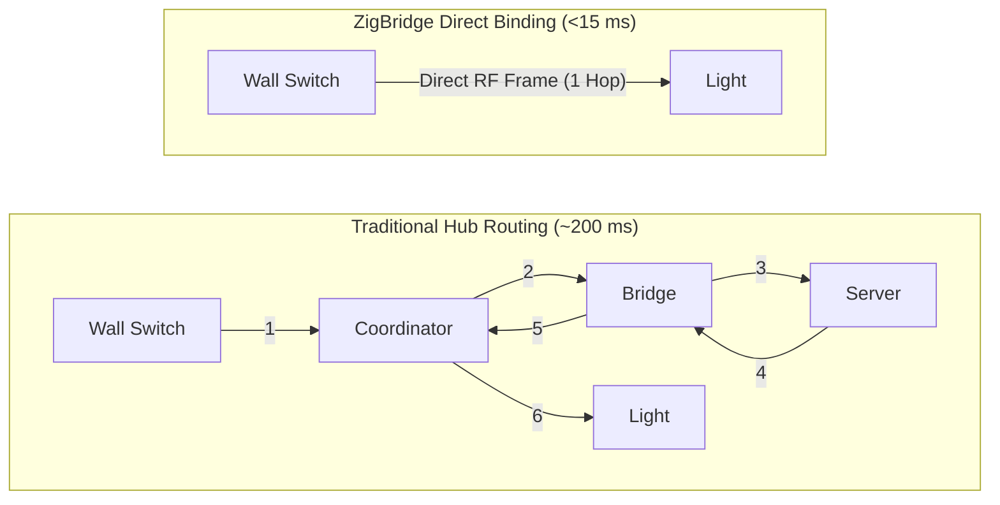

<p align="center">
  
</p>

# ZigBridge

[](https://go.dev/)
[](LICENSE)
[](https://github.com/julienbreux/zigbridge/actions/workflows/ci.yml)
[](https://github.com/julienbreux/zigbridge/actions/workflows/release.yml)

**ZigBridge** is a next-generation Zigbee-to-MQTT bridge and **Direct Binding Orchestrator** built for speed, resilience, and simplicity.

It connects battery remotes, wall switches, and sensors **directly to lights and plugs over the air**. Your smart home responds in less than 15 milliseconds and **keeps working even when your server, Wi-Fi router, or coordinator is completely offline**.

---

## Why ZigBridge?

Traditional smart home bridges route every button press through multiple network hops and software servers. When your Wi-Fi hiccups or your server restarts for an update, the lights in your house stop turning on.

ZigBridge changes the paradigm: it uses the coordinator to orchestrate direct hardware bindings, then steps out of the way.



### The Difference at a Glance

| Capability | Traditional Zigbee Bridges | ZigBridge |
|---|---|---|
| **Switch Latency** | 150 – 300 ms (multi-hop software round-trip) | **<15 ms (direct over-the-air RF)** |
| **Server / Wi-Fi Outage** | ❌ Switches stop working | **✅ Switches ALWAYS work (100% offline)** |
| **Network Coordinators (SLZB-06)** | Fragile TCP sockets; freeze on Wi-Fi drops | **Resilient RFC2217 TCP keepalive & auto-reconnect** |
| **Memory Footprint** | 150 – 350 MB (Node.js runtime + npm modules) | **<25 MB RSS (Pure Go static binary)** |
| **Binary & Dependencies** | Large runtime + native serialport C++ deps | **Single ~8 MB standalone binary (`CGO_ENABLED=0`)** |
| **User Interface** | Cluttered hex codes and developer jargon | **Dual-Mode UI: Simple for family, Advanced for pros** |
| **Home Assistant Setup** | Manual entity creation or heavy add-on | **Instant MQTT Auto-Discovery** |

---

## Superpowers

### ⚡ Zero-Latency Direct Hardware Binding
Program battery switches and remotes to communicate directly with light bulbs and relays. Dim lights smoothly, toggle scenes instantly, and rest easy knowing that if your home automation server crashes, your family can still turn on the lights.

### 🌐 Built for SMLIGHT SLZB-06 & Network Coordinators
Most bridges treat network-attached coordinators as an afterthought. ZigBridge features first-class support for Ethernet/PoE and Wi-Fi coordinators (like the **SMLIGHT SLZB-06** and **TubeZB**) with active TCP keepalive probes, Telnet RFC2217 filtering, and automatic exponential backoff reconnection.

### 📦 Ultra-Lightweight Single Binary
Written in pure, idiomatic Go with zero CGO dependencies. Runs comfortably on low-spec hardware (from a 128 MB RAM OpenWrt router or Raspberry Pi to a high-density Proxmox server) with near-zero CPU usage and zero-allocation packet pooling.

### 👥 Dual-Mode Web Dashboard (Offline & CDN-Free)
A clean, embedded dashboard served straight from the binary with zero external CDN dependencies:
- **Simple Mode (Default)**: Friendly names, device category icons (💡 Light, 🔘 Switch, 🏃 Sensor, 🔌 Plug), qualitative signal ratings (`Excellent`, `Good`, `Fair`, `Poor`), and a human-readable **Activity** feed.
- **Advanced Mode**: 1-click toggle revealing IEEE 64-bit addresses, NWK IDs, cluster hex codes, live ZCL frame inspector, and full-page **Diagnostics**.

### 🏡 Seamless Home Assistant Auto-Discovery
Paired devices automatically announce their capabilities via standard Home Assistant MQTT discovery topics. Sensors, switches, lights, and bridge health entities appear in your Home Assistant dashboard instantly.

### 🧠 On-Demand Smart Binding Recommendations
An in-memory circular telemetry buffer monitors event patterns. With one click, ask ZigBridge to analyze your network and propose direct hardware bindings and multi-way switch automations—either using fast local heuristics or an external LLM hook.

---

## Quick Start (60 Seconds)

### 1. Build or Download
Compile the standalone static binary (requires Go 1.27+):
```bash
git clone https://github.com/julienbreux/zigbridge.git
cd zigbridge
make build
```

### 2. Configure Your Coordinator
Initialize the configuration file:
```bash
make config   # copies config.yaml.dist to data/config.yaml
```
*(Your `data/` directory and local configurations are git-ignored by default to keep MQTT passwords and network keys secure and facilitate easy backups).*

Edit `data/config.yaml` to match your coordinator. For an **SMLIGHT SLZB-06** connected over your local network:
```yaml
transport:
  type: tcp
  url: "tcp://192.168.1.50:6638"    # Your SLZB-06 IP and port

adapter:
  type: zstack
  pan_id: 0x1A62
  channel: 20
```
*(Or set `type: serial` and `port: /dev/ttyUSB0` for local USB dongles like Sonoff ZBDongle-P).*

### 3. Launch
```bash
./bin/zigbridge
```
*(ZigBridge automatically detects `data/config.yaml`, falling back to `config.yaml` or `config.yaml.dist`. You can also specify an explicit path with `./bin/zigbridge -config path/to/config.yaml`).*

Open your browser at **[http://localhost:8080](http://localhost:8080)** to access the Web Management Dashboard.

---

## Documentation

Comprehensive guides, hardware setups, and API references are located in the [`docs/`](docs/) directory:

- 📖 [**Documentation Index**](docs/index.md) - Overview and quick links.
- 🛠️ [**Coordinator Setup Guide**](docs/coordinators.md) - Ethernet/Wi-Fi (SLZB-06) and USB serial dongle setup.
- ⚡ [**Direct Binding Deep Dive**](docs/direct-binding.md) - Hardware bindings, optimistic binding, and cluster reference.
- 🖥️ [**Web Management Dashboard**](docs/web-dashboard.md) - Simple Mode vs Advanced Mode, Activity stream, and Diagnostics tab.
- 🔌 [**REST & WebSocket API Reference**](docs/api.md) - HTTP endpoints and real-time WebSocket event stream.
- ⚙️ [**Configuration Reference**](docs/configuration.md) - Complete line-by-line `config.yaml` options and defaults.
- 🏗️ [**Architecture & Internals**](docs/architecture.md) - Concurrency model, non-blocking event bus, and `sync.Pool`.
- 🧠 [**AI Telemetry & Recommendations**](docs/ai-recommendations.md) - Telemetry ring buffer, heuristics, and LLM hooks.

---

## Development & Testing

```bash
# Run unit tests with race detector
make test

# Run static analysis (go vet + golangci-lint)
make lint

# Cross-compile static binaries for Linux, macOS, and Windows
make cross-compile
```

---

## Community & Contributing

We welcome contributions from everyone! Please check out our project guidelines:

- 🤝 [**Contributing Guide**](CONTRIBUTING.md) - How to report issues, contribute fixtures, and submit pull requests.
- 📜 [**Code of Conduct**](CODE_OF_CONDUCT.md) - Our standards for community engagement.
- 🔒 [**Security Policy**](SECURITY.md) - Responsible vulnerability reporting and best practices.
- 👥 [**Maintainers**](MAINTAINERS.md) - Project maintainers and governance.

---

## License

This project is licensed under the [MIT License](LICENSE).

