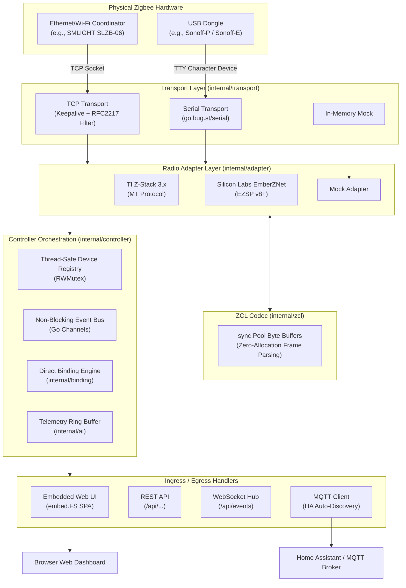

# Architecture & Internals

ZigBridge is designed from the ground up in modern Go for high reliability, minimal resource consumption (<25 MB RAM), and zero external runtime dependencies.

---

## High-Level System Architecture

---

## Core Subsystems

### 1. Transport Layer (`internal/transport`)
The transport layer provides a uniform byte-stream abstraction (`io.ReadWriteCloser`) with resilient lifecycle management:
- **TCP Stream (`tcp.go`)**: Built specifically for networked coordinators like the SMLIGHT SLZB-06. Features active TCP keepalive probes (`SO_KEEPALIVE`), exponential backoff reconnection loops, and an RFC2217 filter that strips Telnet negotiation sequences.
- **Serial Stream (`serial.go`)**: Interfaces directly with local USB UART dongles using `go.bug.st/serial`.
- **Mock Transport (`mock.go`)**: An in-memory, thread-safe bidirectional pipe for tests.

### 2. Radio Adapter Layer (`internal/adapter`)
Decoupled radio drivers translate raw vendor frames into standardized ZigBridge events:
- **TI Z-Stack 3.x (`zstack/`)**: Implements Texas Instruments Monitor and Test (MT) commands (`SYS`, `SAPI`, `AF`, `ZDO`, `UTIL`). Computes and verifies Frame Check Sequences (FCS) with zero allocations.
- **Silicon Labs EmberZNet (`ember/`)**: Implements EZSP v8+ frame formatting and command exchange.
- **Mock Adapter (`mock/`)**: Virtual coordinator simulating network joining, device interviews, and binding responses.

### 3. ZCL Codec & Zero-Allocation Buffer Pool (`internal/zcl`)
Zigbee Cluster Library (ZCL) frame encoding and decoding uses a global `sync.Pool` of reusable byte buffers:
- Buffers are acquired via `zcl.GetBuffer()` and recycled via `zcl.PutBuffer()`.
- Eliminates heap churn and garbage collection pauses during high-throughput sensor telemetry bursts.

### 4. Controller & Thread-Safe Registry (`internal/controller`)
The central orchestrator maintains:
- **Device Registry (`device.go`)**: A thread-safe collection protected by fine-grained `sync.RWMutex`. Tracks 64-bit IEEE addresses, 16-bit network IDs, endpoints, clusters, friendly names, and signal quality (LQI).
- **Non-Blocking Event Bus (`event_bus.go`)**: Distributes events across WebSocket subscribers, MQTT publishers, and telemetry buffers via buffered Go channels. Slow consumers are dropped safely without blocking radio packet processing.
- **Direct Binding Engine (`internal/binding`)**: Manages physical device-to-device bindings, synchronization with coordinator tables, and optimistic bindings for sleepy end devices.

### 5. Embedded Web Server (`internal/web`)
- Distributes a complete single-page application (SPA) bundled inside the binary via Go standard library `embed.FS`.
- Zero external CDN dependencies (100% offline, privacy-first).
- Exposes clean REST API endpoints and a real-time WebSocket event broadcaster (`/api/events`).

### 6. MQTT & Home Assistant Discovery (`internal/mqtt`)
- Publishes device state changes and bridge telemetry to structured MQTT topics (`zigbridge/<friendly_name>`).
- Implements Home Assistant MQTT Auto-Discovery (`homeassistant/binary_sensor/...`, `homeassistant/sensor/...`), allowing all paired devices to appear instantly in Home Assistant without manual YAML configuration.

---

## Memory & Performance Metrics

| Metric | ZigBridge | Typical Node.js Bridge |
|---|---|---|
| **Resident Memory (RSS)** | **<25 MB** | 150 - 350 MB |
| **Binary Size** | **~7.8 MB** (Static, `CGO_ENABLED=0`) | >100 MB (with Node runtime) |
| **Startup Time** | **<50 ms** | 3,000 - 8,000 ms |
| **ZCL Allocation Rate** | Near-zero (Pooled `sync.Pool`) | High (Object churn per frame) |
| **External Dependencies** | **Zero** (Pure static executable) | Node, npm, native C++ serialport |
