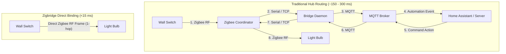

# Direct Binding Deep Dive

**Direct Zigbee Binding** is the core philosophy behind Zigbridge. It allows battery-powered switches, buttons, and motion sensors to communicate directly with light bulbs, smart plugs, and relays over the air—completely bypassing the coordinator and home automation server.

---

## Why Direct Binding Matters

In a traditional smart home architecture, pressing a wall button initiates a multi-hop round trip through multiple network layers and software daemons.

### Traditional Hub Routing vs Direct Binding



### Key Advantages of Direct Binding

1. **Instant Response Time (<15 ms)**:
   The light turns on or dims instantaneously because the command travels directly over the 2.4 GHz Zigbee mesh in a single radio hop.
2. **100% Offline Resilience (Wife/Partner Acceptance Factor)**:
   Even if your Wi-Fi router crashes, your Home Assistant server restarts for an OS update, or the Zigbee coordinator is unplugged, your wall switches **always work**.
3. **Smooth Hardware Dimming**:
   Holding a dimmer button sends smooth step/level commands directly to the bulb driver without stuttering caused by network jitter.
4. **Reduced Network Congestion**:
   Traffic is confined to the local link rather than flooding the coordinator and MQTT broker with high-frequency dimmer frames.

---

## How Direct Binding Works Under the Hood

Every Zigbee device maintains an internal hardware **Binding Table** in its non-volatile memory. A binding entry maps:

- **Source IEEE Address**: 64-bit hardware MAC of the sender (e.g. `0x00124B001CA20001` - wall switch).
- **Source Endpoint**: The logical sub-device (e.g., `1` for Button 1, `2` for Button 2).
- **Cluster ID**: The functional Zigbee cluster to bind (e.g., `0x0006` On/Off, `0x0008` Level Control).
- **Target IEEE Address**: 64-bit hardware MAC of the receiver (e.g. `0x00124B001CA20002` - ceiling light).
- **Target Endpoint**: The target sub-device (usually `1`).

When you create a binding, Zigbridge sends a `ZDO Bind_req` command to the coordinator. The coordinator dispatches this request to the source switch. Once acknowledged, the switch writes the entry into its local flash memory. From that moment forward, pressing the switch transmits unicast or group frames directly to the target light.

---

## Standard Cluster IDs for Direct Binding

| Cluster Name | Cluster ID (Hex) | Decimal | Typical Use Case |
|---|---|---|---|
| **On / Off** | `0x0006` | `6` | Wall switches, smart plugs, toggle buttons |
| **Level Control** | `0x0008` | `8` | Dimmer remotes, brightness rotary knobs |
| **Color Control** | `0x0300` | `768` | Color temperature (kelvin) and RGB wheels |
| **Window Covering** | `0x0102` | `258` | Roller shade up/down/stop controllers |
| **Thermostat** | `0x0201` | `513` | Temperature sensors to TRV radiator valves |

---

## Optimistic Binding (Handling Sleeping End Devices)

Battery-powered switches are **Sleepy End Devices (SEDs)**. To conserve battery, their radio receivers are turned off 99% of the time, waking up only every few seconds or when a button is physically pressed.

In traditional tools, attempting to bind a sleeping switch often results in a timeout error (`Request timed out after 10000ms`) or prevents the user from submitting the form until the device is interviewed.

### How Zigbridge Solves This:
- **Optimistic Binding Acceptance**: Zigbridge accepts the binding request immediately, records it in the binding table, and responds with a status warning (`optimistic: true`).
- **Wake-up Pairing**: The user wakes the device (e.g., by pressing any button on the switch once), and the coordinator delivers the queued `ZDO Bind_req` during the switch's poll window.

---

## Managing Direct Bindings

### 1. Via the Embedded Web Dashboard
1. Open the dashboard at `http://localhost:8080`.
2. Click the **Direct Bindings** tab.
3. Select the **Source Device** (e.g., *Living Room Remote*).
4. Select the **Source Endpoint** (e.g., *Endpoint 1*).
5. Choose the **Cluster** (e.g., *On/Off (0x0006)* or *Level Control (0x0008)*).
6. Select the **Target Device** (e.g., *Living Room Floor Lamp*).
7. Click **Create Direct Binding**.

### 2. Via REST API

#### Create a Binding
```bash
curl -X POST http://localhost:8080/api/bindings \
  -H "Content-Type: application/json" \
  -d '{
    "source_ieee": "0x00124B001CA20001",
    "source_endpoint": 1,
    "cluster_id": 6,
    "target_ieee": "0x00124B001CA20002",
    "target_endpoint": 1
  }'
```

#### List All Active Bindings
```bash
curl -s http://localhost:8080/api/bindings
```

#### Delete a Binding
```bash
curl -X DELETE http://localhost:8080/api/bindings \
  -H "Content-Type: application/json" \
  -d '{
    "source_ieee": "0x00124B001CA20001",
    "source_endpoint": 1,
    "cluster_id": 6,
    "target_ieee": "0x00124B001CA20002",
    "target_endpoint": 1
  }'
```
