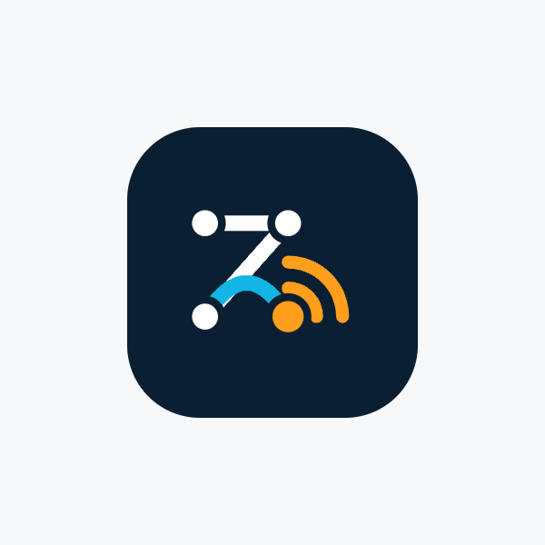

  

# ZigBridge Documentation

Welcome to the official documentation for **ZigBridge**, the lightweight Zigbee-to-MQTT bridge and Direct Binding Orchestrator written in Go.

---

## Documentation Guides

| Guide | Description |
|---|---|
| [**Architecture & Internals**](architecture.md) | Concurrency model, non-blocking event bus, zero-allocation ZCL buffer pool, and thread-safe device registry. |
| [**Coordinator Setup Guide**](coordinators.md) | Connecting network coordinators (SMLIGHT SLZB-06 via TCP/RFC2217) and local USB serial dongles (CC2652, EFR32MG21). |
| [**Direct Binding Deep Dive**](direct-binding.md) | Zero-latency hardware-level bindings, optimistic binding, cluster IDs, and setup walkthroughs. |
| [**Web Management Dashboard**](web-dashboard.md) | Dual-mode web interface (Simple Mode vs Advanced Mode), Activity timeline, and Diagnostics tab. |
| [**REST & WebSocket API Reference**](api.md) | Complete HTTP REST endpoints and real-time WebSocket event streaming documentation with payload examples. |
| [**Configuration Reference**](configuration.md) | Comprehensive line-by-line guide for `config.yaml` options, defaults, and environment setups. |
| [**AI Telemetry & Recommendations**](ai-recommendations.md) | In-memory circular telemetry buffer, heuristic rule analyzer, and external LLM hook integration. |

---

## Quick Navigation

- Want to get started quickly? Check the [Quick Start in README](../README.md#quick-start).
- Setting up an SMLIGHT SLZB-06 over Ethernet or Wi-Fi? Read [Coordinator Setup](coordinators.md#smlight-slzb-06-network--tcp-coordinator).
- Want switches to directly control lights with zero lag even if the server is off? Read [Direct Binding](direct-binding.md).
- Integrating with custom automations? See [REST & WebSocket API](api.md).
